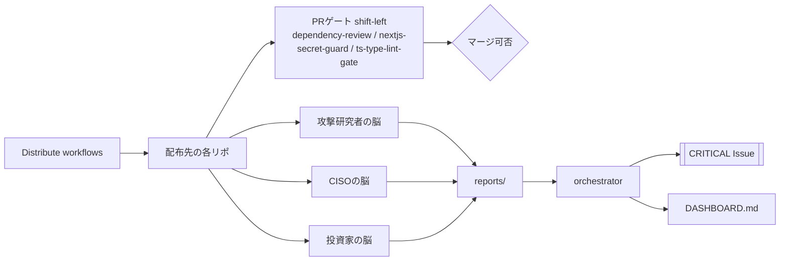

<!--
目的: security-automation の全体像と運用手順を定義するガイドです。
トリガー: 導入時・運用時・障害時に参照します。
依存: .github/workflows と .github/scripts の実装です。
想定実行時間: 読了目安は 10〜20分です。
-->

# security-automation

個人オーナー配下の複数リポジトリを対象に、GitHub Actions と API だけで「攻撃研究者 × CISO × 投資家」の3視点を自動運用するセキュリティ基盤です。

## 1. 概要

- `workflows/*.yml` を配布エンジンで全リポへ展開します。
- **PRゲート（shift-left）** で、危険な依存・クライアント機密露出・型/Lint エラーを**マージ前にブロック**します。
- このリポ専用ワークフローが横断集計・スコアリング・ダッシュボード更新を行います。
- **サプライチェーン硬化**として、全アクションを commit SHA に固定し、Dependabot / zizmor / Scorecard で継続的に検証します。
- Anthropic API などの外部LLMは使わず、GitHub API / NVD / CISA / OSV の公開情報だけで完結します。

## 2. 3つの脳アーキテクチャ

詳細版は `docs/ARCHITECTURE.md` を参照してください。  
統合テスト手順は `docs/TESTING.md` にあります。



## 3. リポジトリ構成

```text
security-automation/
├── .github/
│   ├── dependabot.yml          # github-actions の SHA を週次追従更新
│   ├── scripts/
│   │   ├── cve-intel-collector.sh
│   │   ├── dependency-trend.py
│   │   ├── notify-security-findings.sh
│   │   ├── orchestrator.sh
│   │   ├── risk-scorer.sh
│   │   ├── threat-intel-scraper.sh
│   │   └── weekly-digest.sh
│   └── workflows/              # このリポ専用（配布しない）
│       ├── check-supabase-rls.yml
│       ├── cve-intel.yml
│       ├── distribute-workflows.yml
│       ├── notify-security-findings.yml
│       ├── orchestrate.yml
│       ├── risk-score.yml
│       ├── scorecard.yml       # OpenSSF Scorecard（任意・非ブロッキング）
│       ├── trend-forecast.yml
│       ├── update-dashboard.yml
│       ├── weekly-security-digest.yml
│       └── zizmor.yml          # ワークフロー静的監査（injection/過剰権限/未固定）
├── docs/
│   ├── ARCHITECTURE.md
│   ├── GITHUB_APP_MIGRATION.md # PAT_TOKEN → GitHub App 移行計画
│   └── TESTING.md
├── reports/
│   └── ...（週次成果物）
├── workflows/                  # 全リポへ配布されるテンプレート
│   ├── artillery-load-test.yml
│   ├── auto-merge-dependabot.yml
│   ├── codeql-analysis.yml
│   ├── compliance-checker.yml
│   ├── dependency-review.yml   # PRゲート: 既知脆弱依存をブロック
│   ├── nextjs-secret-guard.yml # PRゲート: クライアント機密露出をブロック（Next.jsのみ）
│   ├── sbom-generate.yml
│   ├── secret-scan.yml
│   ├── trivy.yml
│   ├── ts-type-lint-gate.yml   # PRゲート: tsc --noEmit + eslint（TS/JSのみ）
│   └── zap-baseline.yml        # OWASP ZAP baseline（任意・手動・非ブロッキング）
├── DASHBOARD.md
└── README.md
```

## 4. セットアップ手順

1. `PAT_TOKEN` を Secrets に設定します。  
2. `SUPABASE_DB_URL` を Secrets に設定します（RLSチェック利用時）。  
3. `Distribute workflows` を手動実行します（PRゲート群も各リポへ配布されます）。  
4. `Update dashboard` を手動実行して初期表示を確認します。  
5. （任意）配布先リポの About > Website を設定し、負荷テスト／ZAP の URL 自動解決を有効化します。  
6. （任意・推奨）`APP_ID` / `APP_PRIVATE_KEY` を設定し、広域 `PAT_TOKEN` から短命の GitHub App トークンへ移行します。手順は `docs/GITHUB_APP_MIGRATION.md` を参照してください（未設定時は従来どおり `PAT_TOKEN` で動作します）。

### 必要な Secrets / Variables

| 種別 | 名前 | 必須 | 用途 |
|---|---|---|---|
| Secret | `PAT_TOKEN` | 必須※ | 横断書き込み（配布・Issue起票など）。※App移行が完了するまで |
| Secret | `SUPABASE_DB_URL` | 任意 | RLSチェック利用時 |
| Secret | `APP_ID` / `APP_PRIVATE_KEY` | 任意 | GitHub App 移行用（短命トークン発行） |
| Variable | `ARTILLERY_TARGET_URL` / `ZAP_TARGET_URL` | 任意 | 負荷テスト／ZAP の対象URL（未設定時は About の Website を使用） |

## 5. 週次スケジュール一覧

| Workflow | Cron(UTC) | JST | 役割 |
|---|---|---|---|
| Distribute workflows | `0 0 * * 1` | 09:00 | テンプレート配布 |
| CVE intel | `5 0 * * 1` | 09:05 | Dependabot × NVD収集 |
| Risk score issues | `10 0 * * 1` | 09:10 | P0〜P3付与 |
| Weekly security digest | `20 0 * * 1` | 09:20 | 横断サマリー |
| Trend forecast | `25 0 * * 1` | 09:25 | 脅威/依存トレンド |
| Orchestrate security brains | `30 0 * * 1` | 09:30 | 3層統合判定 |
| Update dashboard | `40 0 * * 1` | 09:40 | ダッシュボード更新 |
| OpenSSF Scorecard | `0 1 * * 1` | 10:00 | サプライチェーン健全性評価（任意・非ブロッキング） |

> 既存の月曜 00:00–00:40 UTC 枠とは衝突しないよう、Scorecard は 01:00 UTC に配置しています。

### イベント駆動（cron なし）のワークフロー

| Workflow | トリガー | 役割 |
|---|---|---|
| Dependency review (PR gate) | `pull_request` | 既知脆弱依存の新規混入をブロック（配布・中程度以上） |
| Next.js client-secret guard (PR gate) | `pull_request` | クライアントへの機密露出をブロック（配布・Next.jsのみ） |
| TS type + lint gate (PR gate) | `pull_request` | `tsc --noEmit` + eslint（配布・TS/JSのみ） |
| Zizmor workflow audit | `push` / `pull_request`（ワークフロー変更時） | ワークフロー静的監査（中央） |
| ZAP baseline scan | `workflow_dispatch` | プレビューURLへの受動スキャン（配布・手動・非ブロッキング） |

## 6. 役割対応表

| 層 | ワークフロー / スクリプト | 主な成果物 |
|---|---|---|
| 攻撃研究者 | `codeql-analysis.yml`, `secret-scan.yml`, `trivy.yml`, `sbom-generate.yml`, `cve-intel-collector.sh` | Security タブ、`reports/cve-intel/*.md` |
| CISO | `risk-scorer.sh`, `weekly-digest.sh`, `compliance-checker.yml` | P0〜P3ラベル、`reports/YYYY-WW.md` |
| 投資家 | `threat-intel-scraper.sh`, `dependency-trend.py` | `reports/threat-intel/*.md`, `reports/trends/*.md` |
| 統合 | `orchestrator.sh`, `update-dashboard.yml` | `reports/orchestrator/*.md`, `DASHBOARD.md`, `[CRITICAL]` Issue |
| PRゲート（shift-left） | `dependency-review.yml`, `nextjs-secret-guard.yml`, `ts-type-lint-gate.yml` | マージ前の失敗チェック（既知脆弱依存／クライアント機密露出／型・Lint） |
| サプライチェーン硬化 | アクションSHA固定, `dependabot.yml`, `zizmor.yml`, `scorecard.yml`, `GITHUB_APP_MIGRATION.md` | 改ざん耐性・最小権限・自動追従更新 |

## 7. トラブルシューティング

- `403/404` が多発する場合  
  `PAT_TOKEN` の権限（`repo`, `workflow`）を再確認してください。

- NVD/CISA/OSV の取得に失敗する場合  
  一時的なレート制限や障害の可能性があります。次週実行まで待機するか手動再実行してください。

- 配布先でワークフローが見えない場合  
  同名ファイルが既に存在すると配布はスキップされます。

- CRITICAL が発火しない場合  
  `reports/orchestrator/*.md` の `Attack/CISO/Investor` 判定値を確認してください。
