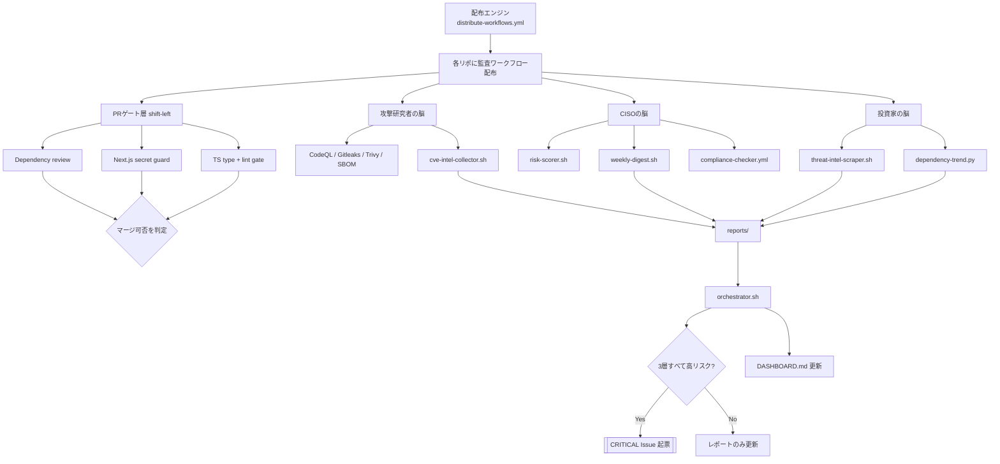

<!--
目的: 3つの脳（攻撃研究者/CISO/投資家）の構成とデータフローを説明する設計書です。
トリガー: 運用時の参照ドキュメントです。
依存: 各 workflow と scripts の実装です。
想定実行時間: 読了目安は 5〜10分です。
-->

# 3つの脳アーキテクチャ

## 全体図（Mermaid）

## レイヤー別責務

- PRゲート層（shift-left）  
  マージ前に「既知脆弱依存の混入」「クライアントへの機密露出（Next.js）」「型/Lint エラー」をブロックし、危険な変更が main に入るのを未然に防ぎます。検知・起票中心の事後型に対し、唯一の**予防的（preventive）**レイヤーです。配布テンプレートは各リポのスタックを自己判定し、無関係なら no-op します。

- サプライチェーン硬化（横断）  
  全アクションを commit SHA に固定し、`dependabot.yml`（自動追従）、`zizmor`（ワークフロー静的監査）、`OpenSSF Scorecard`（健全性評価）で改ざん耐性と最小権限を継続検証します。`PAT_TOKEN` は GitHub App の短命トークンへ移行予定です（`GITHUB_APP_MIGRATION.md`）。

- 攻撃研究者レイヤー  
  脆弱性・秘密情報漏えい・SBOM/CVEを収集し、技術的な危険シグナルを出します。

- CISOレイヤー  
  Issueの優先度化（P0〜P3）と週次サマリーにより、対応順序を組織視点で確定します。

- 投資家レイヤー  
  外部脅威トレンドと依存採用傾向から、将来リスクと技術負債の兆候を早期に検出します。

- 統合レイヤー  
  3層結果を合成し、3条件一致時のみ `[CRITICAL]` を発火してノイズを抑制します。

## データフロー

1. `workflows/*.yml` を全リポへ配布します。  
2. 各リポでセキュリティ系ワークフローが実行されます。  
3. このリポが API 経由で横断集計し、`reports/` に蓄積します。  
4. `orchestrator.sh` が統合判定を実行します。  
5. `update-dashboard.yml` が `DASHBOARD.md` を更新します。
