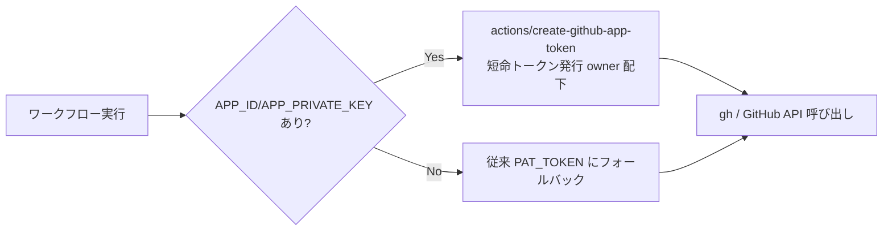

<!--
目的: 広域 PAT_TOKEN から GitHub App（短命・スコープ限定トークン）への移行設計と手動手順を定義する計画書です。
トリガー: サプライチェーン強化の実施時・PAT 棚卸し時に参照します。
依存: actions/create-github-app-token, distribute-workflows.yml ほか PAT_TOKEN 利用ワークフローです。
想定実行時間: 読了 10分／GitHub UI 作業 15〜30分です。
-->

# PAT_TOKEN → GitHub App 移行計画

## 1. 背景と目的

現在、横断書き込み（`distribute-workflows.yml` による他リポの `.github/workflows/` 更新、各種 Issue 起票など）はすべて広域の **`PAT_TOKEN`（`repo` + `workflow` スコープ）** に依存しています。これは次の単一障害点・過剰権限リスクを抱えます。

- **広域**: 個人アカウント配下の全リポに対し、ほぼ全権限を持ちます。
- **長命**: 手動失効まで有効で、漏えい時の被害時間窓が大きいです。
- **属人性**: 特定ユーザーに紐づき、棚卸し・ローテーションが困難です。

GitHub App へ移行すると、**インストール単位でスコープを絞った、既定1時間で失効する短命トークン**を実行時に発行できます。漏えい耐性・最小権限・監査性が大きく向上します。

## 2. 移行アーキテクチャ



`distribute-workflows.yml` には既にこの分岐を **後方互換** で scaffold 済みです（`APP_ID` 未設定なら従来どおり PAT を使用）。

## 3. 必要な最小 App 権限（Repository permissions）

中央ワークフロー群が実際に行う操作から、必要十分な権限は以下です。

| 権限 | レベル | 用途 |
|---|---|---|
| Metadata | Read-only | （必須・既定）リポ一覧・基本情報の取得 |
| Contents | Read and write | 配布先 `.github/workflows/` へのファイル作成、レポートのコミット |
| Workflows | Read and write | `.github/workflows/` 配下（=ワークフローファイル）の作成・更新に必須 |
| Issues | Read and write | セキュリティ Issue の起票・追記、ラベル付与（`security-auto-fix` ほか） |
| Pull requests | Read and write | PR への要約コメント等（Dependency review など） |
| Code scanning alerts | Read-only | `notify-security-findings` のオープンアラート監視 |
| Administration | Read and write | `distribute-workflows` の Secret scanning / Push protection 有効化（broad なため §7 参照） |

> メモ: `Administration: Read and write` はやや強い権限です。Secret scanning 自動有効化が不要であれば付与せず、その部分だけ別の限定 PAT に残す運用も可能です（§7）。

## 4. 追加が必要な Secrets

| Secret 名 | 値 | 設定先 |
|---|---|---|
| `APP_ID` | GitHub App の数値 App ID | `security-automation`（および中央ワークフローを動かすリポ） |
| `APP_PRIVATE_KEY` | App の秘密鍵（`.pem` の全文、改行含む） | 同上 |

`PAT_TOKEN` は移行完了（§6 Phase 3）まで残置します。

## 5. 手動手順チェックリスト（GitHub UI）

> これらは Claude では実行できないため、ご本人の操作が必要です。

- [ ] **1. App 作成**: GitHub → Settings → Developer settings → **GitHub Apps** → **New GitHub App**
  - [ ] App name（例: `mito-security-automation`）、Homepage URL（リポ URL で可）
  - [ ] **Webhook の Active を OFF**（本用途では不要）
  - [ ] **Repository permissions** を §3 のとおり設定
  - [ ] **Where can this GitHub App be installed?** → **Only on this account**
- [ ] **2. 秘密鍵生成**: 作成後の App 設定画面で **Generate a private key** → ダウンロードした `.pem` を保管
- [ ] **3. App ID 控え**: 同画面上部の **App ID（数値）** を控える
- [ ] **4. インストール**: 左メニュー **Install App** → 自アカウントへ Install → **All repositories**（横断配布のため）を選択
- [ ] **5. Secrets 登録**: `security-automation` リポ（Settings → Secrets and variables → Actions）に
  - [ ] `APP_ID` = 控えた数値
  - [ ] `APP_PRIVATE_KEY` = `.pem` の**全文**（`-----BEGIN...` から `-----END...` まで）
- [ ] **6. 動作確認**: Actions → **Distribute workflows** を手動実行し、ログに「GitHub App 認証を使用します（短命トークン）。」が出ることを確認
- [ ] **7.（任意・最終）** 全ワークフロー移行後に `PAT_TOKEN` を削除

## 6. 段階移行プラン

- **Phase 0（完了）**: `distribute-workflows.yml` に App 優先・PAT フォールバックの scaffold をマージ。`APP_ID` 未設定の間は挙動不変。
- **Phase 1**: §5 で App を作成し Secrets を登録 → `distribute-workflows.yml` が自動的に App トークンへ切替。
- **Phase 2**: 他の `PAT_TOKEN` 利用ワークフロー（`cve-intel` / `risk-score` / `weekly-security-digest` / `trend-forecast` / `orchestrate` / `update-dashboard` / `notify-security-findings` / `check-supabase-rls`、配布テンプレートの `artillery-load-test`）へ §6.1 のスニペットを順次適用。
- **Phase 3**: すべて App 経由で動作確認できたら `PAT_TOKEN` を失効・削除。

### 6.1 各ワークフローへの適用スニペット（コピペ用）

`actions/checkout` の直後に以下を挿入し、本処理ステップの `GH_TOKEN`（または `github-token`）を差し替えます。

```yaml
      - name: Detect GitHub App credentials
        id: auth
        env:
          APP_ID: ${{ secrets.APP_ID }}
        shell: bash
        run: |
          set -euo pipefail
          if [[ -n "${APP_ID:-}" ]]; then echo "use_app=true" >> "$GITHUB_OUTPUT"; else echo "use_app=false" >> "$GITHUB_OUTPUT"; fi

      - name: Mint GitHub App installation token
        id: app_token
        if: steps.auth.outputs.use_app == 'true'
        uses: actions/create-github-app-token@d72941d797fd3113feb6b93fd0dec494b13a2547 # v1.12.0
        with:
          app-id: ${{ secrets.APP_ID }}
          private-key: ${{ secrets.APP_PRIVATE_KEY }}
          owner: ${{ github.repository_owner }}

      # 以降のステップで:
      #   GH_TOKEN: ${{ steps.app_token.outputs.token || secrets.PAT_TOKEN }}
      # （github-script の場合は github-token: 同上）
```

## 7. 注意・ロールバック

- **Secret scanning 有効化（Administration 権限）**: 強めの権限です。不要なら App から外し、その操作だけ最小スコープの PAT に限定する選択も可能です。
- **トークン寿命**: App トークンは既定1時間。長時間ジョブでは失効に注意します（現状の各ジョブは数分〜十数分で問題ありません）。
- **owner-wide トークン**: `repositories` を指定しなければ owner 配下のインストール済み全リポ向けになります。さらに絞るなら `repositories:` を明示します。
- **ロールバック**: `APP_ID` シークレットを削除すれば、scaffold が自動的に `PAT_TOKEN` フォールバックへ戻ります（コード変更不要）。
